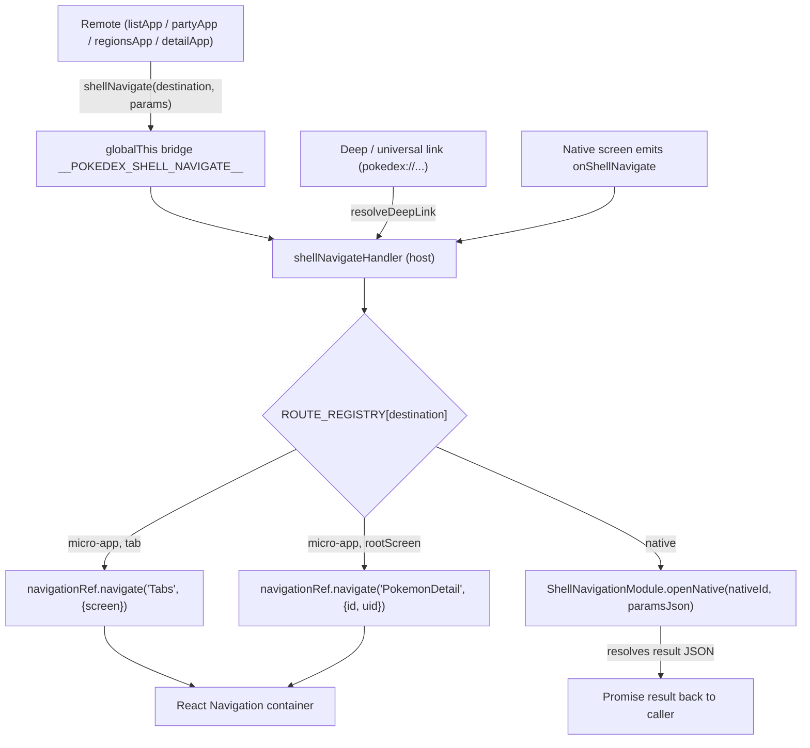

# Architecture

How the host shell, the shared contracts package, the federated remotes, navigation, and the single Redux store fit together. This doc is about the runtime shape of the app. For federation mechanics (version resolution, CDN layout, code signing, fallback, health checks), see [module-federation.md](module-federation.md).

## The three-box model

The app is split into three kinds of thing. Each owns a narrow slice and is barred from owning the others' slices. That separation is what lets a remote ship weeks after the host binary and still slot in.

### Box 1: the host shell

`apps/host` is the React Native binary that ships to the App Store. It owns everything the remotes can't carry themselves:

- The single `AppRegistry` entry. `apps/host/index.js` registers one component. There is no second entry point; the remotes are JavaScript bundles, not apps.
- The navigation graph. The bottom-tab navigator and the root native-stack live in `apps/host/src/shell/AppNavigator.tsx`. Remotes provide screens; the host decides where they mount.
- The one Redux store (`apps/host/src/shell/store.ts`) and the host-owned party slice (`apps/host/src/shell/partySlice.ts`).
- The routing handler behind `shellNavigate`, plus all URL handling. `resolveDeepLink` lives in the host (`apps/host/src/shell/deepLink.ts`) because the host is the only thing that turns a URL into navigation.
- The native modules and the ScriptManager that loads remote bundles.

The host must **not** know any remote's internal screens, reducers, or query keys at build time. It imports remotes only through federated specifiers (`import('listApp/ListStack')`) resolved at runtime, and it reacts to cross-module Redux actions by string, never by importing a remote's slice file.

### Box 2: `@pokedex/contracts`

`packages/contracts` is the agreed interface every side compiles against. It is small and carries no UI and no side effects:

- `ROUTE_REGISTRY` and the `shellNavigate` bridge (`shellNavigation.ts`).
- The cross-module action-type strings (`actions.ts`).
- The shared `baseApi` (RTK Query) instance (`api.ts`).
- The native bridge envelope and module declarations.

Contracts must **not** own navigation behaviour, store wiring, or feature code. It declares the route registry; the host implements what each route does. It declares the action strings; the host's slice decides how to react. It exports the `baseApi` object; remotes and the host inject endpoints into it. Contracts is the vocabulary, not the behaviour.

### Box 3: the remotes

`apps/list`, `apps/party`, `apps/regions`, and `apps/detail` are the features. Each is a JavaScript-only federated remote with no native project of its own. Each is an MF V2 container exposing one navigation stack (or one screen, for detail). Shared dependencies are declared lazy so a remote consumes the host's singleton instances rather than bundling its own.

`apps/list/src/ListStack.tsx` is the reference shape. It:

- composes the shared `@pokedex/ui` design system,
- injects a query endpoint into the host's shared `baseApi`,
- reads the host-owned party count via `useSelector`,
- navigates cross-feature with `shellNavigate('PokemonDetail', { id })`.

A remote must **not** own the navigator, the store, or any other remote's code. It reaches the rest of the app only through contracts: `shellNavigate` for navigation, action strings for cross-module state, the shared `baseApi` for data. It never imports another remote, and never imports the host.

## Navigation

The host owns one root native-stack sitting over the bottom tabs. The three feature remotes mount as tabs. The detail remote is federated but is **not** a tab. It mounts as a root-stack screen (`PokemonDetail`, presented modally) so it can be pushed over any tab and dismissed back to wherever the user was. `ROUTE_REGISTRY` is the single place that records this layout.

Each tab is a thin wrapper that lazy-loads a remote's exposed stack through a federation boundary:

```ts
const loadList = () =>
  import('listApp/ListStack').then(m => ({ default: m.ListStack }));
```

The import specifier matches the remote's MF `name` plus its exposed key (`listApp` + `./ListStack`), defined in each remote's rspack `exposes`. The navigator only knows it gets back a component; it never sees the remote's internals.

### `shellNavigate`: the routing surface

A remote that wants to move the user somewhere calls one function from contracts:

```ts
shellNavigate('PokemonDetail', { id });
```

It does not know, and does not need to know, whether the destination is another tab, the cross-cutting detail screen, or a fully native flow. The host resolves the destination name against `ROUTE_REGISTRY` and dispatches:

- `micro-app` + `tab`: switch bottom tab via `navigationRef.navigate('Tabs', { screen })`.
- `micro-app` + `rootScreen`: push `PokemonDetail` onto the root stack, forwarding `id` and (when present) the party slot `uid`.
- `native`: hand off to `ShellNavigationModule.openNative(nativeId, paramsJson)`. The native view controller presents, takes input, dismisses, and resolves the JavaScript promise with a result object. QuickBattle and ShareTeam go this way.

The bridge between a remote and the host's real handler runs through `globalThis`. The host registers its handler at boot (`registerShellNavigateHandler` in `App.tsx`); `shellNavigate` reads the same `globalThis` slot. The contracts package is bundled into both the host and every remote, so a React Context defined in contracts would have a different reference in each copy. `globalThis` is one runtime with one slot, so there is no identity mismatch.

Three entry points feed the same handler, so micro-app navigation, native-driven navigation, and deep links all share one routing table:

- A remote calling `shellNavigate`.
- A native screen emitting `onShellNavigate` (routed back through the same handler).
- A deep or universal link, mapped to a destination by `resolveDeepLink` and then routed through the same handler.

Adding a destination is one row in `ROUTE_REGISTRY`. Moving a native feature to a remote later is a one-row edit with no change on the calling side.



## The single store

There is one Redux store, built in the host (`store.ts`) with `combineSlices` from RTK 2.x:

```ts
const rootReducer = combineSlices(partySlice, baseApi);
```

At boot the host wires in only the genuinely shared pieces: the host-owned party slice and the shared `baseApi` (RTK Query). Everything else a remote needs is added at runtime.

`combineSlices` gives runtime composition through two paths:

- **Endpoint injection.** A remote calls `baseApi.injectEndpoints({...})` when it loads, adding its own query endpoints to the host's shared RTK Query cache. `apps/list/src/listApi.ts` is the example: the Pokédex grid's query lives in the remote, not the host, yet runs against the host's one cache.
- **Slice injection.** A remote calls `rootReducer.inject(theirSlice)` to register a feature-local reducer (list's filter, regions' selection) without the host knowing about it at build time.

Both only work because the remote operates on the **host's instance** of these objects. If a remote bundled its own copy of `@reduxjs/toolkit` and its own `baseApi`, `injectEndpoints` would mutate a different cache from the one `Provider` renders against, and `inject` would target a reducer the store never sees. That is why `@reduxjs/toolkit`, `react-redux`, and `redux-persist` are MF singletons: the host provides one instance, every remote consumes it.

The party slice is host-owned and present from boot rather than injected by a remote, because three remotes touch it. listApp reads the count, detailApp adds and removes members, partyApp manages the list. Host-ownership lets listApp read party state on first launch even before partyApp has loaded. The store exposes `rootReducer` so remotes can inject against the same instance.

Persistence is deliberately narrow. Only the party slice is persisted (via MMKV-backed redux-persist). The RTK Query cache is not persisted, so Pokémon data is fresh on each launch. A remote that wants its own injected slice persisted wires that itself.

## The contract

`@pokedex/contracts` carries the identity that every side has to agree on:

- **Route registry.** `ROUTE_REGISTRY` plus the `shellNavigate` bridge. The host implements navigation; the registry is the shared list of destinations remotes may name.
- **Action strings.** `CROSS_MODULE_ACTIONS` holds the cross-module Redux action types (`'list/addToParty'`, `'party/remove'`, `'detail/addToParty'`, `'party/battleResult'`). A remote that dispatches owns its constant; a slice that listens imports only the string and reacts in `extraReducers`. No remote imports another remote's slice.
- **The shared `baseApi` instance.** This is the one in contracts that genuinely needs reference identity. A remote's `injectEndpoints()` has to hit the exact object the host built its store from. Two copies of `baseApi` would mean two caches. That is the load-bearing reason `@pokedex/contracts` is an MF singleton: the host provides one instance, remotes consume it.

The action strings travel a softer path. String equality holds across copies (`'list/addToParty'` is `'list/addToParty'` regardless of how many copies of contracts exist), so the action constants do not strictly require reference identity the way `baseApi` does. They are shared for one definition and one place to change them, not because the runtime would break otherwise.

The single-source-of-truth list of which packages are shared singletons lives in `mf-shared.mjs` at the repo root. Every rspack config (`apps/host/rspack.config.mjs` and each remote's) imports `getMFShared` from it, so the host and the remotes can never disagree on the list. Why each entry is shared, and how versions resolve, is covered in [module-federation.md](module-federation.md).
