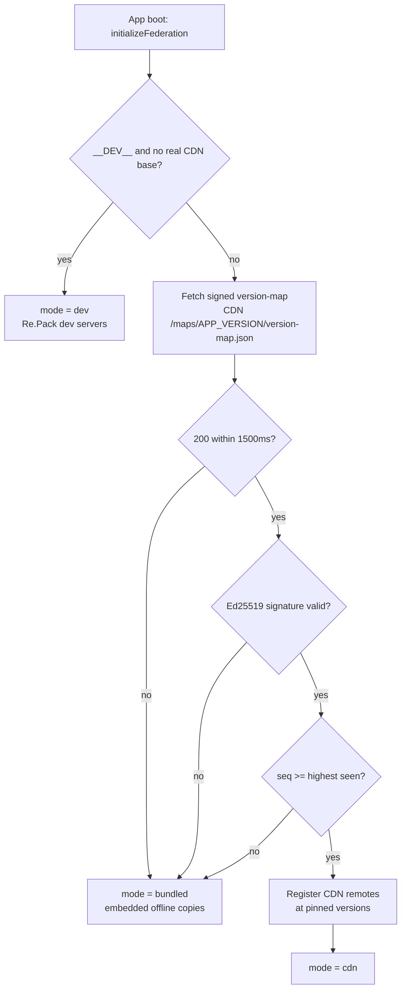
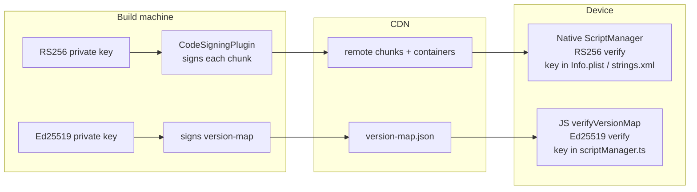
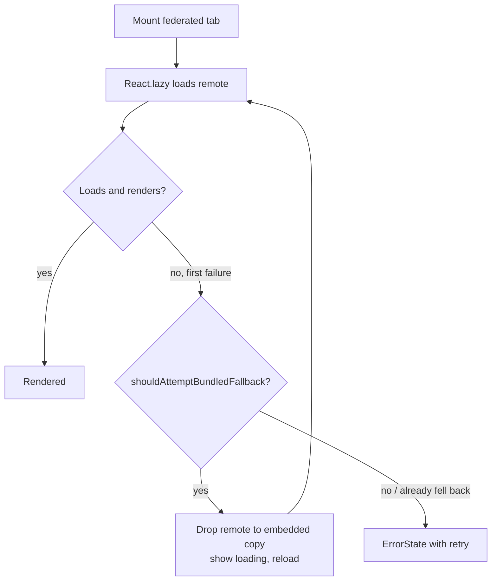

# Module Federation

How Module Federation V2 works in this project, in enough detail to copy into your own React Native app. The stack is Re.Pack 5 + Rspack with `@module-federation/enhanced` and its runtime. Everything below is drawn from the code in `apps/host`, `apps/list`, and `mf-shared.mjs`.

The host is the App Store binary: the React Native runtime, the navigation shell, and an embedded copy of every remote. The remotes are JS-only micro-apps with no native project of their own. They load into the host's runtime at boot, either from per-remote dev servers, from a CDN, or from the copies baked into the binary.

This doc covers the runtime mechanics. For the release build, health monitoring, and auto-rollback, see [release-guide.md](release-guide.md).

## The contract: expose and consume

A federated module has two sides. The remote **exposes** a module under a key. The host **consumes** it with a dynamic import whose specifier is `<remote-name>/<exposed-key>`.

The remote side, from `apps/list/rspack.config.mjs`:

```js
new Repack.plugins.ModuleFederationPluginV2({
  name: 'listApp',
  filename: 'listApp.container.js.bundle',
  exposes: {
    './ListStack': './src/ListStack.tsx',
  },
  dts: false,
  shared: getMFShared('remote', pkg),
}),
```

The `name` (`listApp`) and the exposed key (`./ListStack`) are the whole contract. The host side, from `apps/host/src/shell/AppNavigator.tsx`:

```js
const loadList = () =>
  import('listApp/ListStack').then(m => ({ default: m.ListStack }));
```

`import('listApp/ListStack')` resolves to the module the remote exposed under `./ListStack`. The specifier is `name` + key, minus the leading `./`. The host declares each remote in its own config (`apps/host/rspack.config.mjs`) so the bundler knows the names ahead of time:

```js
remotes: {
  listApp: remoteUrl('listApp'),
  partyApp: remoteUrl('partyApp'),
  regionsApp: remoteUrl('regionsApp'),
  detailApp: remoteUrl('detailApp'),
},
```

The other three remotes follow the same shape on the consume side: `import('partyApp/PartyStack')`, `import('regionsApp/RegionsStack')`, and `import('detailApp/PokemonDetailScreen')`. Each remote's `name` and exposed key must match its consume specifier exactly, or the import resolves to nothing.

`detailApp` is consumed but is not a tab. It is the cross-cutting PokemonDetail screen, pushed onto a root native-stack that sits over the tabs, so any tab can navigate to it. That is why it is a remote without being a tab.

### The three env vars you tune

Everything operational is driven by three build-time variables baked into the JS via `DefinePlugin`:

| Variable | Lives in | Controls |
|---|---|---|
| `MF_CDN_BASE` | host config | The CDN base URL. Also flips the host into CDN mode in a dev build when set to a real base (not the placeholder). Default `https://cdn.example.com/mf`. |
| `MF_APP_VERSION` | host config | The app version this binary reports to the CDN at boot. Picks which version-map it gets back. Defaults to the host `package.json` version; for a real release it must match the native store version. |
| `MF_REMOTE_VERSION` | remote config | The version a remote builds as, and the `cdn/<platform>/<remote>/<version>/` path it writes to. Default `0.0.1`. |

## Three runtime modes

A launch resolves to one of three modes. The decision happens once, in `initializeFederation` (`apps/host/src/shell/scriptManager.ts`), before the navigator mounts.

- **dev**: Re.Pack's per-remote dev servers on ports 8082 to 8085. Re.Pack's own resolution handles everything; the project's resolver no-ops.
- **cdn**: a release build (or a dev build with a real `MF_CDN_BASE`) fetches a signed version-map at boot and loads each remote at the version the map pins.
- **bundled**: if the probe fails (offline, CDN down, first launch, or a rejected map), the host loads the prod bundles the embed phase baked into the app, from disk. Always a known-good set.



The probe doubles as the CDN reachability check and the integrity gate. A single fetch decides whether the CDN is reachable and whether what it returned can be trusted. Any failure on that path lands in bundled mode on the embedded set, so a broken or hostile CDN can never stop the app from starting.

The mode and resolved versions are exposed via `getFederationStatus` for the on-screen banner, so you can see at a glance which path a launch took.

## Version resolution

CDN mode does not pin remote versions at build time. The host binary ships knowing only the CDN base and its own app version. Each launch probes for the version-map and gets back the set of remote versions to run:

```
GET <CDN_BASE>/<platform>/maps/<APP_VERSION>/version-map.json
```

The map is keyed by `APP_VERSION` on purpose. The remote code a binary loads has to be compatible with the shared libraries that binary carries. So the CDN hands each app version its own map. An old app keeps getting a map that only references remote versions it can actually run; the CDN retires a remote version only once no live app version's map still points at it.

Shipping a remote in CDN mode is an upload plus a version-map line. No host rebuild, no store submission.

### The seq counter (replay and rollback guard)

The version-map carries a `seq`: a release counter that only moves forward. The device remembers the highest `seq` it has accepted, in MMKV, across restarts (`mf.versionMap.seq`).

A map whose `seq` is below that high-water mark is rejected. That blocks two attacks at once: a replay of an old signed map, and a forced downgrade where a compromised CDN pushes you back to a vulnerable release whose signature still checks out.

The inversion to keep straight: rolling back on purpose still works. You publish a **new** map with a **higher** `seq` that points at the **older** remote versions. The counter moves forward while the version numbers go back. The guard is on the counter, never on the version numbers, so a deliberate rollback is accepted and a replayed old map is not.

`seq` is checked in `verifyVersionMap` (`versionMapVerify.ts`); equal is fine (a re-fetch of the current release), strictly lower is rejected.

## Shared singletons

Some libraries cannot be bundled twice. If the host and a remote each carry their own copy of React, you get two React trees and hooks blow up. The same applies to navigation, the store, and the design system. These must be **shared**: one copy, provided by the host, that every remote renders against.

The list lives in one place, `mf-shared.mjs`, imported by the host config and every remote config so it can never drift between them. Drift is exactly what makes a "shared" dependency silently get bundled twice.

What is shared, and why it must be:

- **react, react-native, the navigation packages, react-native-screens, safe-area-context**: one React tree and one navigation graph across host and remotes.
- **@reduxjs/toolkit, react-redux, redux-persist**: remotes inject endpoints and slices into the host's single store at runtime. That only works against the host's store instance.
- **nativewind**: the `cssInterop` style registry is module-level singleton state. A remote's styled components must register against the host's registry, not their own.
- **@shopify/flash-list**: the recycling list engine behind the grid. FlashList v2 is pure JS on the new architecture, so sharing it is for dedup and one consistent version, not nativeness.
- **@pokedex/contracts, @pokedex/ui**: the route registry and the design system. Remotes need the host's `ROUTE_REGISTRY` identity and the same Gluestack provider and theme.

What is deliberately **not** shared:

- **react-native-mmkv / nitro**: host-only storage; remotes never touch them.
- **react-native-reanimated / worklets**: native singletons already; sharing the worklets runtime is fragile.
- **react/jsx-runtime**: NativeWind owns the JSX runtime via `jsxImportSource`.

The rule is to share only what the federation contract genuinely requires, mirroring Re.Pack's own `tester-federation-v2` host.

### Eager host, lazy remote

The host is the eager provider; remotes are lazy consumers. `getMFShared(side, pkg)` flips one field:

```js
const eager = side === 'host';
shared[name] = {
  singleton: true,
  eager,
  ...(range ? { version, requiredVersion: range } : { requiredVersion: '*' }),
};
```

Eager means the host loads its copy up front and IS the single instance everyone uses. Lazy (`eager: false`) means a remote consumes the host's instance instead of bundling its own. Because the host is the eager provider, the host's pinned versions are what actually ship at runtime.

Two subtle fields in that map are worth getting right, because both fail silently:

- **`version` vs `requiredVersion`.** `version` is the concrete version this side provides; `requiredVersion` is the semver range it accepts. If you pass a raw caret range as `version` (say `^0.4.0`), the runtime evaluates `satisfies("^0.4.0", "^0.4.0")`, which is false because a range is not a concrete version, and logs a "does not satisfy" warning for every caret-ranged singleton. So `getMFShared` strips the range operator: `^0.4.0` becomes `0.4.0`, the exact version this pinned monorepo installs.
- **A missing `requiredVersion` makes MF V2 silently drop the shared config** for that package. So it is always set, falling back to `'*'` when the package has no declared range.

### The `usedExports: false` trap

The host config carries this:

```js
optimization: {
  usedExports: false,
},
```

Used-exports tree-shaking assumes a closed module graph. It prunes any export the bundle itself never imports. For a normal app that is correct. For a federation host providing a shared library, it is wrong, and it fails silently.

The host shares `@pokedex/ui` as an eager singleton. Tree-shaking pruned every export of that barrel the host itself never imported, which dropped the entire primitives set (Box, Text, Image, and the rest) from the shared namespace. Remotes that imported those got `undefined` and crashed at render. The set of exports a remote might need is unknown when the host builds, so the provider has to keep the shared library's full public API. `usedExports: false` does exactly that. The cost is a few unused-export bindings in the host bundle, which is the right trade for a host whose job is to expose complete shared singletons.

This is scoped to the shared-provider problem. Tree-shaking is still correct for a normal app. The point is narrower: a federation host cannot prune a library it provides to consumers it cannot see.

## Integrity

Two signing layers protect two different things. They use different algorithms and are verified in different places.



**Chunk signing protects content.** Re.Pack's `CodeSigningPlugin` signs every remote chunk in prod builds: an RS256 JWT of the chunk's hash. The public key is embedded in the native app (iOS `Info.plist` `RepackPublicKey`, Android `res/values/strings.xml` `RepackPublicKey`). The native ScriptManager verifies the signature before executing any CDN- or disk-loaded code, so a tampered or swapped bundle is rejected before it runs. The resolver sets `verifyScriptSignature: 'strict'` on iOS and Android, and `'off'` on any platform with no signing tooling. Dev bundles are unsigned; the Re.Pack dev server serves them and its dev resolver handles them.

**Version-map signing protects the choice of version.** Chunk signing says each bundle is authentic, but says nothing about which bundle you were told to load. A compromised or replaying CDN could serve an old, validly-signed, vulnerable release. So the version-map is signed with Ed25519 and verified in JS by `verifyVersionMap`. Verification runs in JS because Hermes has no WebCrypto, and Ed25519 via `@noble/ed25519` is pure JS (wired to `@noble/hashes` for the SHA-512 it needs, on the synchronous verify path). The embedded public key can only verify, never sign, so it is safe to ship. The signing input is canonical and independent of JSON key order: remote names sorted, each rendered `name@version`, joined, prefixed with the `seq`. The build side must produce the identical string.

So: RS256 on chunks, verified natively, protects content. Ed25519 on the map, verified in JS, protects the version choice. The `seq` guard sits on top of the map's signature.

## Fallback: an old app never breaks

The promise is that whatever the CDN serves, a shipped binary still works, because it carries an embedded copy of every remote that is always compatible with it. Falling back to the embedded copy is always safe.

Fallback is per-remote, in-memory, and self-healing. One remote dropping to its embedded copy does not touch the others. The set is in-memory on purpose: a transient failure clears on the next launch when the boot probe re-runs. The flag that decides whether to attempt it, `shouldAttemptBundledFallback`, is true only in CDN mode, only once per remote, and only when an embedded copy of that remote actually exists.

There are two levels at which a CDN load can fail, and the fallback has to catch both.

**Manifest-fetch level**, in `scriptManager.ts`. The MF runtime asks for a remote's `mf-manifest.json` to learn its shared-dependency config. If that fetch fails, the runtime throws an unhandled "failed to get manifest" that crashes a release build before any React error boundary can see it. So a runtime plugin owns the fetch: `cdnManifestOrEmbedded` tries the network with a timeout and, on any failure (a 404 from a retired version, a dropped network), drops the remote to its embedded copy and resolves with the embedded manifest. It always resolves to a `Response`, so the runtime never sees an unhandled throw.

**Render level**, in `FederatedTabBoundary.tsx`. The first time a CDN-loaded remote throws at render (a failed load, or code built against a newer shared library than this binary carries), `componentDidCatch` drops that remote to its embedded copy and reloads, showing the loading state, not the error, during the swap. The boundary bumps an `attempt` counter that keys the inner slot, so React unmounts and remounts and creates a fresh `React.lazy` that re-invokes the loader. A cached failure would otherwise stick. Only if the embedded copy also throws does the user see the error state with a retry button.



The boundary also validates the export explicitly. MF V2's runtime sometimes resolves a failed manifest fetch to a module that lacks the expected export, rather than rejecting. So the loader checks the default export is a function and throws a clear, attributable error if it is not:

```js
const Component = m.default;
if (typeof Component !== 'function') {
  throw new Error(`Federated module "${name}" loaded but did not export a component ...`);
}
```

That throw feeds the same fallback path: a remote that loads but is structurally wrong is treated like a remote that failed to load, and drops to its embedded copy.
