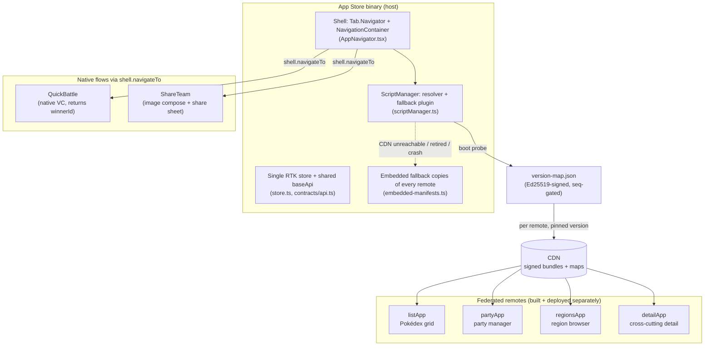

# Overview

## What this is

A host React Native app that loads its features as separately-built, separately-deployable federated remotes at runtime. The four features (the Pokédex list, the party manager, the region browser, and a cross-cutting detail screen) each ship as their own bundle. The host fetches a signed version-map at boot, then pulls each remote at the version that map pins, from a CDN, over HTTP. On top of that sits the operational layer the approach needs to be safe in production: code-signed CDN bundles, per-launch version resolution, an embedded offline fallback baked into the binary, health-driven auto-rollback, and one routing surface that mediates between federated screens and native flows.

The host is the only thing shipped through the App Store. Adding or updating a feature is an upload plus one line in the version-map, with no host rebuild.

## What it proves

Eight capabilities, each mapped to the code that implements it. Every path below has been checked against the repo.

| Capability | Where it lives |
|---|---|
| Module Federation V2 on RN | Three federated tabs plus one cross-cutting screen, loaded from the CDN at runtime. Loaders: `apps/host/src/shell/AppNavigator.tsx` (the `import('listApp/ListStack')` style specifiers). Each remote's `exposes` map: `apps/{list,party,regions,detail}/rspack.config.mjs`. Shared-singleton list: `mf-shared.mjs` and `packages/contracts/src/mfShared.ts`. |
| RN-owned shell + navigation | Single `AppRegistry.registerComponent` entry: `apps/host/index.js`. The host's `Tab.Navigator` plus root native-stack that orchestrate the federated tabs: `apps/host/src/shell/AppNavigator.tsx`. Boot gate that resolves federation before the navigator mounts: `apps/host/App.tsx`. |
| RTK + RTK Query single store | One store with `combineSlices` runtime injection: `apps/host/src/shell/store.ts`. The shared `baseApi` instance remotes inject endpoints into: `packages/contracts/src/api.ts`. |
| Cross-module dispatch via contract strings | Action-type constants the dispatching slice owns and listening slices import as strings, with no build-time coupling: `packages/contracts/src/actions.ts`. |
| Per-launch version resolution | Boot probe fetches `cdn/<platform>/maps/<appVersion>/version-map.json`, then registers each remote at its pinned version: `fetchVersionMap` and `registerCdnRemotes` in `apps/host/src/shell/scriptManager.ts`. |
| Version-map integrity (signature + replay gate) | Ed25519 signature check plus a monotonic release-counter gate, so a tampered or replayed map is rejected: `apps/host/src/shell/versionMapVerify.ts`, called from `scriptManager.ts`. The signing key is generated by `tools/gen-signing-keys.mjs`; the map is signed by `tools/build-cdn.mjs`. |
| Signed CDN bundles | Resolver attaches `verifyScriptSignature: 'strict'` on iOS and Android, so the native ScriptManager rejects a tampered or swapped chunk before running it: the resolver block in `apps/host/src/shell/scriptManager.ts` and `apps/host/src/shell/remoteLocator.ts`. The public key is embedded in `Info.plist` / `strings.xml`; chunks are signed in `tools/build-cdn.mjs`. |
| Offline-ready bundled fallback | When the CDN is unreachable, or a remote's version is retired, or loaded code crashes, the remote drops to the embedded copy the app shipped with: the bundled-fallback plugin and `markRemoteBundledFallback` in `apps/host/src/shell/scriptManager.ts`, with the boundary in `apps/host/src/shell/FederatedTabBoundary.tsx`. Embedded manifests: `apps/host/src/shell/embedded-manifests.ts`. Android asset extraction: `apps/host/specs/NativeEmbeddedRemotesModule.ts`. |
| Health monitoring + auto-rollback | A CDN remote that throws is recorded once and resolves to its embedded copy for the rest of the session; the boot probe re-runs next launch so a transient failure self-heals: `bundledFallbackRemotes`, `shouldAttemptBundledFallback`, and `forceReloadRemote` in `apps/host/src/shell/scriptManager.ts`; the catch path in `apps/host/src/shell/FederatedTabBoundary.tsx`. |
| `shell.navigateTo` (RN to native and back) | One routing table resolves a destination to either React Navigation or a native view controller, and native calls return a promise that resolves with the native result: `ROUTE_REGISTRY` in `packages/contracts/src/shellNavigation.ts`, host handler `shellNavigateHandler` in `apps/host/src/shell/shellNavigation.ts`, native module `apps/host/specs/NativeShellNavigationModule.ts`. |

One more piece that supports the model: a Redux middleware pushes state envelopes to the native side after every action (RN to native, one direction), in `apps/host/src/shell/nativeBridge.ts`, using the envelope and key contracts in `packages/contracts/src/`.

## The shape

The amber bundled path is the dashed line: when the probe fails or a remote fails to load, the resolver serves the embedded copy instead of the CDN one.

## Where to go next

- `architecture.md` covers the three-box model: host, contracts, and remotes, and what each side is allowed to know about the others.
- `module-federation.md` covers the federation mechanics in depth: version resolution, the signed version-map, the bundled fallback, health and rollback, and the `shell.navigateTo` routing surface.
- `release-guide.md` covers the operational flow: building and signing the CDN, the rollback layers, and CI examples.
