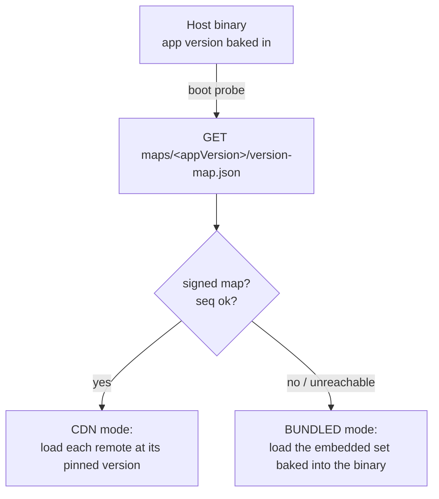
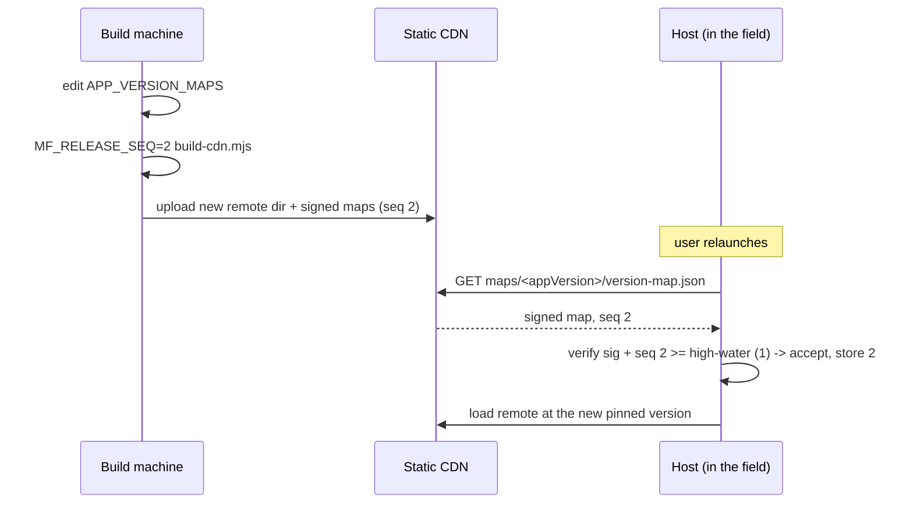
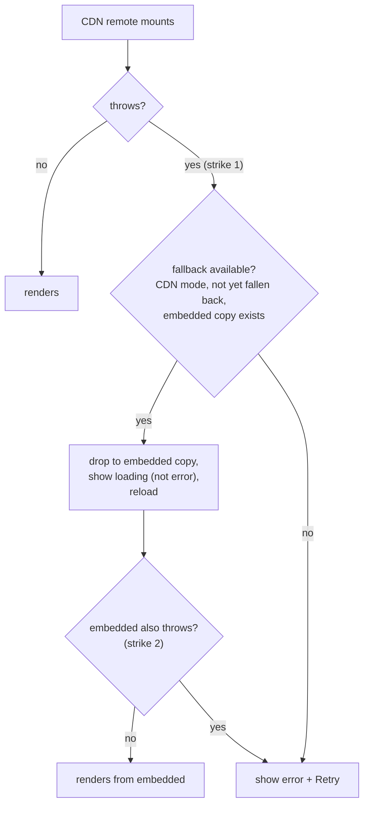
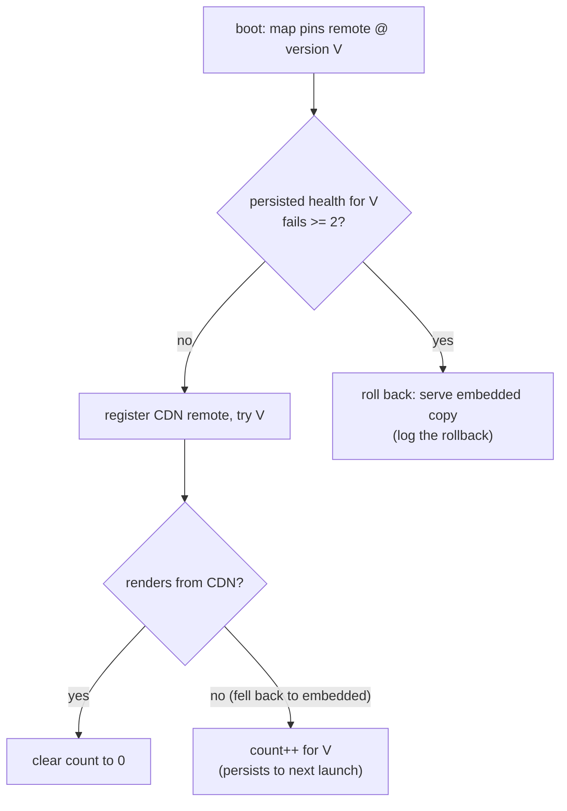
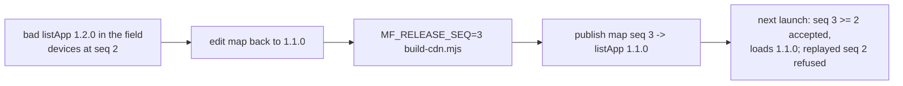

# Release guide

How to operate this federation in production: cut a release, ship a new remote version over the CDN, and rely on the offline fallback and rollback when something goes wrong.

This guide is grounded in the build scripts (`tools/`, `scripts/`) and the host's boot path (`apps/host/src/shell/`). Where a behaviour is dev-only or release-only, it says so.

## The version model

Each store release of the host carries an **app version**, frozen into the binary at build time (`__APP_VERSION__` in `scriptManager.ts`, set from `MF_APP_VERSION`). At boot the host fetches a signed **version-map** for its own app version:

```
<cdn-base>/<platform>/maps/<appVersion>/version-map.json
```

The map lists one version per remote. The host loads each remote at exactly the version its map names, and never any other version. A 2.0.0 binary asks for the 2.0.0 map; a 1.0.0 binary still on a user's phone asks for the 1.0.0 map. The two maps can point at different remote versions:

```js
// tools/build-cdn.mjs
const APP_VERSION_MAPS = {
  '1.0.0': { listApp: '1.0.0', partyApp: '1.0.0', regionsApp: '1.0.0', detailApp: '1.0.0' },
  '2.0.0': { listApp: '1.1.0', partyApp: '1.0.0', regionsApp: '1.0.0', detailApp: '1.0.0' },
};
```

Here 2.0.0 ships a newer `listApp` (1.1.0) while 1.0.0 stays pinned to `listApp` 1.0.0. An old binary is never handed code built for a newer host.

Keep an old app version's map (and the remote versions it points at) live on the CDN until no user is left on that app version, then retire both. It is the same discipline as keeping an old API endpoint alive until the last caller is gone.



### The two integrity layers

Two independent signatures protect the prod paths, both verified on-device.

- **Chunk signing (RSA-2048, RS256).** Every remote chunk is signed by Re.Pack's `CodeSigningPlugin`. The native `ScriptManager` verifies the signature before executing any CDN- or disk-loaded chunk (`verifyScriptSignature: 'strict'` on iOS and Android). A tampered or swapped bundle is rejected. The public key lives in the iOS `Info.plist` (`RepackPublicKey`) and Android `strings.xml` (`RepackPublicKey`).
- **Version-map signing (Ed25519).** The map itself is signed and gated on a monotonic release counter (`seq`). Chunk signing protects each chunk's *content*; the version-map signature protects the *choice* of version, so a replaying CDN can't serve an old, validly-signed, vulnerable release. The public key is `VERSION_MAP_PUBLIC_KEY` in `scriptManager.ts`. See `versionMapVerify.ts`.

Both private keys live only on the build machine and are gitignored. The embedded halves can verify, not sign, so they are safe to ship.

## Building the CDN

The CDN is assembled locally and served as static files. The wrapper `scripts/build-prod-ios.sh` runs two steps:

```bash
MF_CDN_BASE=http://localhost:8000 ./scripts/build-prod-ios.sh
```

### Step 1: signing keys

```bash
node tools/gen-signing-keys.mjs
```

Generates the two keypairs into `code-signing/` if they don't already exist (`private-key.pem` + `public-key.pem` for RSA, `version-map-private.pem` for Ed25519). Existing keys are kept; regenerating would invalidate every embedded public half. The script then **embeds the public halves** into the three places the app verifies against, so a fresh clone is build-ready after one command:

| Public key | Embedded into |
|---|---|
| RSA (full PEM) | `apps/host/ios/Host/Info.plist` → `RepackPublicKey` |
| RSA (base64, one line) | `apps/host/android/.../res/values/strings.xml` → `RepackPublicKey` |
| Ed25519 (`jwk.x`) | `apps/host/src/shell/scriptManager.ts` → `VERSION_MAP_PUBLIC_KEY` |

If a patch can't find its target it prints `WARNING: could not embed ...` and leaves the file untouched. Check for that warning before building.

### Step 2: assemble and sign

```bash
node tools/build-cdn.mjs            # both platforms (ios + android, kept in lockstep)
node tools/build-cdn.mjs ios        # iOS only, leaves the android subtree intact
```

For each platform it:

1. Collects every remote version referenced by any app-version map (so each is built once).
2. Builds each remote's prod Module Federation output via `npm run bundle:<platform>:prod` in that remote's package, with `MF_REMOTE_VERSION` set to the target version. Output is code-signed.
3. Lays them out at `cdn-root/<platform>/<remote>/<version>/`.
4. Writes one **signed** `version-map.json` per app version at `cdn-root/<platform>/maps/<appVersion>/`.
5. Regenerates `apps/host/src/shell/embedded-manifests.ts` for the app version being built (see [The release build](#the-release-build)).

`build-prod-ios.sh` only builds the iOS subtree. To bake the Android embedded set as well, run `node tools/build-cdn.mjs` (no arg) so `cdn-root/android` exists before the APK build.

### What the env vars select

| Variable | Default | Effect |
|---|---|---|
| `MF_APP_VERSION` | newest configured (`2.0.0`) | Which app version's set is baked as the embedded fallback. **Must match the `MF_APP_VERSION` the host binary is built with**, so the offline set matches what that binary carries. |
| `MF_RELEASE_SEQ` | `1` | The monotonic counter signed into every map. The host refuses a map whose `seq` is below the highest it has seen. Bump it on every publish. |
| `MF_CDN_BASE` | placeholder | Where the host probes for the map. Set it to your static server. |

### cdn-root layout

```
cdn-root/
  ios/
    maps/
      1.0.0/version-map.json     # signed, lists remote versions for app 1.0.0
      2.0.0/version-map.json     # signed, lists remote versions for app 2.0.0
    listApp/1.0.0/  listApp/1.1.0/
    partyApp/1.0.0/  regionsApp/1.0.0/  detailApp/1.0.0/
  android/
    ... same shape ...
```

Serve it with any static server:

```bash
npm run serve:cdn          # npx http-server cdn-root -p 8000 -c-1 --cors
```

## The green CDN path (verified)

This path is confirmed working end to end against a local server, in a **dev build**, without a release build. It exercises CDN fetch, signature checks, seq gate, and per-version loading.

```bash
# 1. build + serve the CDN
MF_CDN_BASE=http://localhost:8000 ./scripts/build-prod-ios.sh
npm run serve:cdn

# 2. run the host pointed at the CDN, pinned to a built map version
cd apps/host
MF_CDN_BASE=http://localhost:8000 MF_APP_VERSION=2.0.0 npm run ios
```

A dev build normally runs in DEV mode (Metro). When `MF_CDN_BASE` is set to something other than the placeholder, the host switches to **CDN mode** even in a dev build, so this path can be demoed without packaging a release (`CDN_CONFIGURED` in `scriptManager.ts`). The banner shows `⬢ CDN · ...` with the resolved versions. Pin `MF_APP_VERSION` to a version that has a built map (`1.0.0` or `2.0.0`), or the boot probe 404s and the host can't resolve.

## Shipping a new remote version

No host rebuild. The host picks up the new version at the next launch.

1. **Add the version to the build config.** In `APP_VERSION_MAPS` (`tools/build-cdn.mjs`), point the current app version's entry at the new remote version, e.g. bump `listApp` to `1.2.0` for app `2.0.0`.
2. **Build and sign with a higher seq.**
   ```bash
   MF_RELEASE_SEQ=2 node tools/build-cdn.mjs
   ```
   This builds the new remote version into `cdn-root/<platform>/listApp/1.2.0/` and rewrites the signed maps with `seq: 2`.
3. **Publish** the new remote directory and the updated `version-map.json` files to the CDN.
4. **Next launch.** Each host re-probes its own app version's map, verifies the signature and the higher seq, advances its high-water counter, and loads the new version. Older app versions read their own maps and are untouched.



The seq must move forward. A map whose seq is below the device's stored high-water counter is rejected as a replay (`stale-seq` in `versionMapVerify.ts`).

## The release build

CDN mode covers the online case. The **offline `BUNDLED` fallback** needs a real **release build** that bakes a known-good copy of every remote into the binary. This is the production release path. A dev-server build cannot demonstrate it, because the embed phases run for Release and there is no `.app`/APK to read embedded files from.

Two pieces make it work, both produced by `build-cdn.mjs` and consumed at build time:

- **`embedded-manifests.ts`** (auto-generated, do not edit). `EMBEDDED_MANIFESTS` holds each remote's `mf-manifest.json`, served offline by the MF runtime plugin without a network call. `BUNDLED_VERSIONS` tells the resolver which version subdirectory to build `file://` URLs against. Both reflect the `MF_APP_VERSION` the CDN was built for, so they must match the binary's `MF_APP_VERSION`.
- **The embed phase** copies the signed `.bundle` files from `cdn-root` into the app, preserving the `<remote>/<version>/` layout.

### iOS

The Xcode build phase **"Embed Federated Remotes (offline fallback)"** runs `apps/host/scripts/embed-remotes-ios.sh` after "Bundle React Native code and images". It `rsync`s `cdn-root/ios/` into the `.app` at `cdn/ios/<remote>/<version>/`, copying only `.bundle` files and preserving the per-remote and per-version subdirectories. The layout must be preserved: different remotes share vendor chunk filenames, and a flat copy would clash. At runtime the host derives the `.app` directory from `SourceCode.scriptURL` and builds **absolute** `file://` URLs into that tree.

### Android

A Gradle `Copy` task **`embedCdnAssets`** (`apps/host/android/app/build.gradle`) copies `cdn-root/android/**/*.bundle` into a generated assets dir that is merged into the APK at `assets/cdn/android/<remote>/<version>/`. APK assets are not real filesystem paths, so the native `EmbeddedRemotesModule` (`EmbeddedRemotesModule.kt`) extracts `assets/cdn` into the app's files dir on first launch and returns that path. Extraction is idempotent per app version (a `.version` marker), and files are copied **byte-for-byte** because they are code-signed over their bytes. `initializeFederation` calls `NativeEmbeddedRemotes.prepare(APP_VERSION)` before any remote can load, so the file root is ready in time.

Build order matters: run `node tools/build-cdn.mjs` (both platforms) so both `cdn-root/ios` and `cdn-root/android` exist **before** the iOS archive and the APK build. Both embed steps are no-ops if their source subtree is missing, and you'd ship a binary with no offline set.

### Offline-fallback demo

1. Make a **release build** with the embedded set baked in (CDN built first, then archive/APK).
2. Launch it with the CDN reachable. The banner shows `⬢ CDN · ...`.
3. Kill the CDN server (or take the device offline).
4. Relaunch. The boot probe fails, the host falls back to the embedded set, and the banner shows:

```
⬢ BUNDLED · embedded (offline)
```

amber, versus the green CDN pill. The app runs fully on the bundles it shipped with.

## Health and rollback

There are four mechanisms. The first three are automatic and live in the host; the fourth is the operator lever.

### 1. App-wide bundled mode (boot probe fails)

If the version-map probe fails for any reason (unreachable, bad signature, replayed or older seq), `fetchVersionMap` returns `null` and the whole app boots in **bundled mode** on the embedded set (`initializeFederation`). The banner shows `BUNDLED`. This is the offline path above; it is also the safe response to a CDN that is serving a map the host won't trust.

### 2. Per-remote in-session fallback (one remote misbehaves)

If a single remote fails *after* a healthy boot (its version was retired and 404s, the network drops mid-session, or its loaded code crashes at runtime), only that remote drops to its embedded copy. Other remotes keep loading from the CDN. The failed remote is added to an in-memory set (`bundledFallbackRemotes` in `scriptManager.ts`) and resolves to the embedded copy for the rest of the session.

The set itself is **in-memory on purpose**: a *single* transient failure self-heals on the next launch, when the boot probe re-runs and the remote is tried from the CDN again. What does survive a launch is a small per-remote failure *count* (next section), so a version that keeps failing is eventually rolled back instead of retried forever.

`FederatedTabBoundary.tsx` drives the user-visible side, and it is effectively two strikes **within a session**:



Strike 1: the CDN remote throws; the boundary swaps it to the embedded copy behind a loading state, so the swap is invisible. Strike 2: if the embedded copy *also* throws, the user finally sees the error with a Retry. The embedded copy shipped with the app and is always compatible with this binary, so strike 2 is rare. This is what makes "an old app never breaks regardless of what the CDN serves it" hold.

### 3. Per-remote cross-launch auto-rollback (one version keeps failing)

In-session fallback (above) saves the current run, but on its own it would retry the same bad CDN version on every launch forever. The host closes that gap with a tiny persistent health record per remote, so a version that fails repeatedly is dropped to its embedded copy automatically, with no operator action.

The record is one MMKV key per remote (`mf.health.<remote>`), holding the CDN version it is counting and a consecutive-failure count. The pure transitions live in `remoteHealth.ts`; `scriptManager.ts` persists them:

- **On a failed load** (`addBundledFallback`, the common point for both a failed manifest fetch and a runtime crash that drops to embedded): increment the count for the resolved version. A failure of a *different* version (a new release) resets the count to 1, so a fixed redeploy is never blocked by the old version's failures.
- **On a clean render** (`markRemoteLoadSuccess`, fired by `FederatedTabBoundary` only when the remote actually rendered *from the CDN*, not from a fallback): clear the count back to 0.
- **At boot** (`initializeFederation`, before remotes are registered): if the version the map now pins has already failed `FAILURE_THRESHOLD` (2) launches in a row, add it to the bundled-fallback set up front. The manifest plugin and resolver then serve its embedded copy for the whole session, and the host logs `rolling back <remote>: CDN version <v> failed 2 launches in a row`.

Because the count is keyed on `(remote, version)`, the rollback is sticky for exactly the bad version and lifts itself the moment the operator ships a different version. A first single failure still self-heals; only the second consecutive failure of the *same* version trips the rollback.



### 4. Operator rollback (republish a higher seq)

To pull a bad remote version from the field deliberately, point the app version's map back at the older remote version and republish with a **higher** seq:

```bash
# revert listApp to 1.1.0 in APP_VERSION_MAPS, then:
MF_RELEASE_SEQ=3 node tools/build-cdn.mjs
```

The counter, not the version numbers, is what must move forward. A device that already advanced to seq 2 accepts the seq-3 map even though it points at older code, and rejects any replay of the seq-2 map that the bad CDN might still be serving. Keep the older remote directory on the CDN (don't delete what you're rolling back to). At the next launch each host probes, accepts the higher seq, and loads the rolled-back version.



## Quick reference

| Task | Command |
|---|---|
| Generate / re-embed keys | `node tools/gen-signing-keys.mjs` |
| Build signed CDN, both platforms | `MF_RELEASE_SEQ=<n> node tools/build-cdn.mjs` |
| Build signed CDN, iOS only (wrapper) | `MF_CDN_BASE=http://localhost:8000 ./scripts/build-prod-ios.sh` |
| Serve the CDN | `npm run serve:cdn` |
| Demo CDN path (dev build) | `cd apps/host && MF_CDN_BASE=... MF_APP_VERSION=2.0.0 npm run ios` |
| Ship a new remote version | edit `APP_VERSION_MAPS`, build with a higher `MF_RELEASE_SEQ`, publish |
| Roll back | point the map at the older version, publish with a higher `MF_RELEASE_SEQ` |

Rules that bite if ignored:

- The CDN's `MF_APP_VERSION` and the binary's `MF_APP_VERSION` must match, or the embedded set won't match what the binary runs.
- `MF_RELEASE_SEQ` must increase on every publish, including rollbacks.
- Build `cdn-root` before the release archive / APK, or the embed phases ship nothing.
- Never regenerate the signing keys for an app version already in the field; it invalidates every binary that embedded the old public halves.
